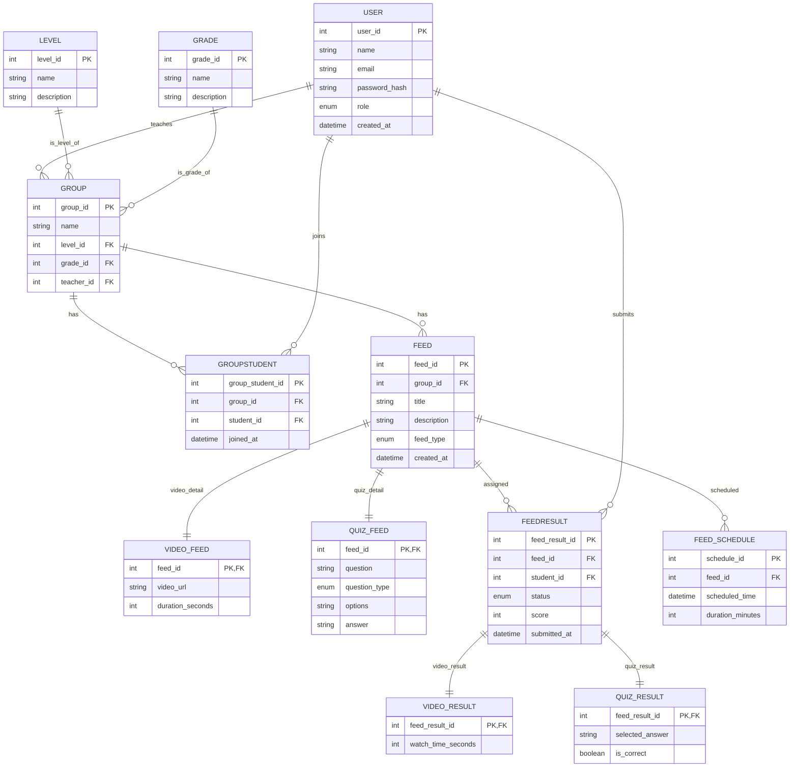

# LMS Toy Project

## 1. 테이블 정의

### 1.1. 사용자 (User)

| 컬럼명         | 타입      | 설명                        |
| -------------- | --------- | --------------------------- |
| user_id        | INT (PK)  | 사용자 고유 ID              |
| name           | STRING    | 이름                        |
| email          | STRING    | 이메일                      |
| password_hash  | STRING    | 비밀번호 해시               |
| role           | ENUM      | 'teacher', 'student'        |
| created_at     | DATETIME  | 생성일시                    |

---

### 1.2. 수준 (Level)

| 컬럼명     | 타입      | 설명                        |
| ---------- | --------- | --------------------------- |
| level_id   | INT (PK)  | 수준 고유 ID                |
| name       | STRING    | 수준명 (예: 초급, 중급 등)  |
| description| STRING    | 설명                        |

---

### 1.3. 학년 (Grade)

| 컬럼명     | 타입      | 설명                        |
| ---------- | --------- | --------------------------- |
| grade_id   | INT (PK)  | 학년 고유 ID                |
| name       | STRING    | 학년명                      |
| description| STRING    | 설명                        |

---

### 1.4. 그룹 (Group)

| 컬럼명     | 타입      | 설명                        |
| ---------- | --------- | --------------------------- |
| group_id   | INT (PK)  | 그룹 고유 ID                |
| name       | STRING    | 그룹명                      |
| level_id   | INT (FK)  | 수준 ID (Level.level_id)    |
| grade_id   | INT (FK)  | 학년 ID (Grade.grade_id)    |
| teacher_id | INT (FK)  | 담당 선생님 (User.user_id)  |

---

### 1.5. 그룹-학생 매핑 (GroupStudent)

| 컬럼명           | 타입      | 설명                        |
| ---------------- | --------- | --------------------------- |
| group_student_id | INT (PK)  | 매핑 고유 ID                |
| group_id         | INT (FK)  | 그룹 ID (Group.group_id)    |
| student_id       | INT (FK)  | 학생 ID (User.user_id)      |
| joined_at        | DATETIME  | 그룹 가입일                 |

---

### 1.6. 피드 (Feed)

| 컬럼명      | 타입      | 설명                              |
| ----------- | --------- | --------------------------------- |
| feed_id     | INT (PK)  | 피드 고유 ID                      |
| group_id    | INT (FK)  | 그룹 ID (Group.group_id)          |
| title       | STRING    | 피드 제목                         |
| description | STRING    | 피드 설명                         |
| feed_type   | ENUM      | 'video', 'multiple_choice', 'grammar', ... |
| created_at  | DATETIME  | 생성일시                          |

---

### 1.7. 동영상 피드 (VideoFeed)

| 컬럼명           | 타입      | 설명                        |
| ---------------- | --------- | --------------------------- |
| feed_id          | INT (PK, FK) | 피드 ID (Feed.feed_id)   |
| video_url        | STRING    | 동영상 URL                  |
| duration_seconds | INT       | 동영상 길이(초)             |

---

### 1.8. 퀴즈 피드 (QuizFeed)

| 컬럼명        | 타입      | 설명                        |
| ------------- | --------- | --------------------------- |
| feed_id       | INT (PK, FK) | 피드 ID (Feed.feed_id)   |
| question      | STRING    | 문제 내용                   |
| question_type | ENUM      | 문제 유형                   |
| options       | JSON      | 선택지                      |
| answer        | STRING    | 정답                        |

---

### 1.9. 피드-학생 결과 (FeedResult)

| 컬럼명         | 타입      | 설명                              |
| -------------- | --------- | --------------------------------- |
| feed_result_id | INT (PK)  | 결과 고유 ID                      |
| feed_id        | INT (FK)  | 피드 ID (Feed.feed_id)            |
| student_id     | INT (FK)  | 학생 ID (User.user_id)            |
| status         | ENUM      | 'not_started', 'in_progress', 'completed' |
| score          | INT       | 점수 (nullable, 문제 유형일 때)   |
| submitted_at   | DATETIME  | 제출일시                          |

---

### 1.10. 동영상 결과 (VideoResult)

| 컬럼명            | 타입      | 설명                        |
| ----------------- | --------- | --------------------------- |
| feed_result_id    | INT (PK, FK) | 결과 ID (FeedResult.feed_result_id) |
| watch_time_seconds| INT       | 시청 시간(초)               |

---

### 1.11. 퀴즈 결과 (QuizResult)

| 컬럼명           | 타입      | 설명                        |
| ---------------- | --------- | --------------------------- |
| feed_result_id   | INT (PK, FK) | 결과 ID (FeedResult.feed_result_id) |
| selected_answer  | STRING    | 선택한 답                   |
| is_correct       | BOOLEAN   | 정답 여부                   |

---

### 1.12. 피드 스케줄 (FeedSchedule)

| 컬럼명         | 타입      | 설명                        |
| -------------- | --------- | --------------------------- |
| schedule_id    | INT (PK)  | 스케줄 고유 ID              |
| feed_id        | INT (FK)  | 피드 ID (Feed.feed_id)      |
| scheduled_time | DATETIME  | 예정 시간                   |
| duration_minutes| INT      | 학습 가능 시간(분)          |

---

## 2. 관계 설명

- **User**: 선생님과 학생 모두 포함. `role`로 구분
- **Level/Grade**: 그룹의 수준과 학년을 정규화
- **Group**: 선생님이 여러 그룹을 가질 수 있음. 그룹은 한 명의 선생님이 담당. 수준/학년은 별도 테이블 참조
- **GroupStudent**: 학생은 여러 그룹에 속할 수 있음 (예: 레벨별, 과목별)
- **Feed**: 그룹 단위로 생성. 같은 그룹 학생들에게 동일 피드가 배포됨. 피드 유형별 상세 정보는 별도 테이블로 분리
- **FeedResult**: 학생별 피드 결과 기록. 학습 진도, 점수 등. 유형별 결과는 별도 테이블로 분리
- **FeedSchedule**: 피드의 스케줄 관리

---

## 3. ERD 다이어그램 (Mermaid)


4. 설계 이유
```
4.1. 정규화를 통한 일관성·무결성 보장
    Level/Grade 분리
        문자열로 직접 관리하면 오타·중복 등 데이터 품질 이슈가 생기기 쉬움
        별도 LEVEL, GRADE 테이블로 관리하면 “1:초급 / 2:중급” 식으로 코드를 중앙에서 정의·관리 가능
        
    Feed / FeedResult 타입별 테이블 분리 (Class‑Table Inheritance)        
        모든 feed 속성을 한 테이블에 두면 대부분 칼럼이 NULL이 되거나, 새로운 타입마다 스키마 변경이 필요
        타입별로 전용 테이블을 두면,        
            타입에 고유한 속성들은 제약조건으로 강제 가능
            쿼리 시 불필요한 칼럼 없이 깔끔하게 조회

4.2. 유연한 진도·스케줄 관리
    FEED_SCHEDULE을 두어 “언제 어떤 피드를 학습해야 하는지”를 명확히 분리
    향후 ‘반복 스케줄’, ‘알림 설정’ 등을 확장할 여지 마련
```

5. 현재 설계의 부족한 점 및 확장성 이슈
```
5.1. 타입 추가 시마다 스키마·코드 변경 필요
    새로운 feed(예: 과제형, 토론형 등)가 생길 때마다
    FEED에 enum 추가
    전용 테이블(ASSIGNMENT_FEED, DISCUSSION_FEED 등) 생성
    어플리케이션 레이어(DAO/Repository, DTO, 서비스/컨트롤러) 수정
    → 운영 중 스키마 마이그레이션, 배포 부담이 커짐

5.2. 조인이 많아질수록 성능 저하 우려
    기본 피드는 FEED, 타입별 디테일은 각각 전용 테이블을 JOIN 해야 하므로
    조회할 때 테이블 수가 많아질수록 복잡도·응답 시간 증가

5.3. 동적 속성(Dynamic Attributes) 모델 미비
    예컨대 “퀴즈” 안에서도 문제 유형별(객관식, 주관식)로 속성이 더 달라질 수 있는데
    지금 구조론 매번 테이블을 다시 만들어야 함
```

6. 피드 종류 확장 시 대안 모델
```
6.1. 메타모델 + 속성 테이블 (EAV: Entity‑Attribute‑Value) 패턴
    FEED_TYPE, FEED_ATTRIBUTE_DEF 같은 메타 테이블을 두고
    실제 값들은 FEED_ATTRIBUTE_VALUE(feed_id, attr_id, value)에 저장
    → 스키마 변경 없이 새로운 피드 타입·속성 추가 가능
    단점: 제약조건이 느슨해지고, 복잡 쿼리가 많아짐

6.2. JSON / JSONB 컬럼 활용
    공통 칼럼 외에 FEED.payload JSONB 같은 칼럼 하나로
    타입별 상세 정보를 모두 직렬화 저장
    → 스키마 변경 최소화, 유연성 극대화
    단점: JSON 내 필드 제약·인덱싱이 제한적

6.3. 플러그인 아키텍처 + 마이크서비스
    피드 타입별로 별도 서비스(또는 플러그인) 모듈을 구축
    공통 인터페이스만 정의하고, 세부 구현은 각 모듈에 위임
    → 대규모·다양성 많은 시스템에 적합
    단점: 운영 복잡도, 서비스간 통신 오버헤드
```
