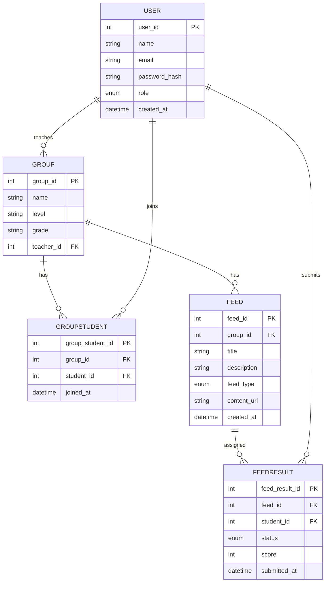

# LMS Toy Project

## 1. 테이블 정의

### 1.1. 사용자 (User)

| 컬럼명         | 타입      | 설명                        |
| -------------- | --------- | --------------------------- |
| user_id        | INT (PK)  | 사용자 고유 ID              |
| name           | STRING    | 이름                        |
| email          | STRING    | 이메일                      |
| password_hash  | STRING    | 비밀번호 해시               |
| role           | ENUM      | 'teacher', 'student'        |
| created_at     | DATETIME  | 생성일시                    |

---

### 1.2. 그룹 (Group)

| 컬럼명     | 타입      | 설명                        |
| ---------- | --------- | --------------------------- |
| group_id   | INT (PK)  | 그룹 고유 ID                |
| name       | STRING    | 그룹명                      |
| level      | STRING    | 수준 (예: 초급, 중급 등)    |
| grade      | STRING    | 학년                        |
| teacher_id | INT (FK)  | 담당 선생님 (User.user_id)  |

---

### 1.3. 그룹-학생 매핑 (GroupStudent)

| 컬럼명           | 타입      | 설명                        |
| ---------------- | --------- | --------------------------- |
| group_student_id | INT (PK)  | 매핑 고유 ID                |
| group_id         | INT (FK)  | 그룹 ID (Group.group_id)    |
| student_id       | INT (FK)  | 학생 ID (User.user_id)      |
| joined_at        | DATETIME  | 그룹 가입일                 |

---

### 1.4. 피드 (Feed)

| 컬럼명      | 타입      | 설명                              |
| ----------- | --------- | --------------------------------- |
| feed_id     | INT (PK)  | 피드 고유 ID                      |
| group_id    | INT (FK)  | 그룹 ID (Group.group_id)          |
| title       | STRING    | 피드 제목                         |
| description | STRING    | 피드 설명                         |
| feed_type   | ENUM      | 'video', 'multiple_choice', 'grammar', ... |
| content_url | STRING    | 외부 리소스 URL                   |
| created_at  | DATETIME  | 생성일시                          |

---

### 1.5. 피드-학생 결과 (FeedResult)

| 컬럼명         | 타입      | 설명                              |
| -------------- | --------- | --------------------------------- |
| feed_result_id | INT (PK)  | 결과 고유 ID                      |
| feed_id        | INT (FK)  | 피드 ID (Feed.feed_id)            |
| student_id     | INT (FK)  | 학생 ID (User.user_id)            |
| status         | ENUM      | 'not_started', 'in_progress', 'completed' |
| score          | INT       | 점수 (nullable, 문제 유형일 때)   |
| submitted_at   | DATETIME  | 제출일시                          |

---

## 2. 관계 설명

- **User**: 선생님과 학생 모두 포함. `role`로 구분
- **Group**: 선생님이 여러 그룹을 가질 수 있음. 그룹은 한 명의 선생님이 담당
- **GroupStudent**: 학생은 여러 그룹에 속할 수 있음 (예: 레벨별, 과목별)
- **Feed**: 그룹 단위로 생성. 같은 그룹 학생들에게 동일 피드가 배포됨
- **FeedResult**: 학생별 피드 결과 기록. 학습 진도, 점수 등

---

## 3. ERD 다이어그램 (Mermaid)
